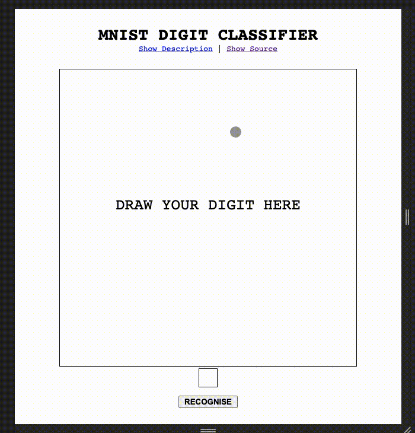

# mnist-digit-classifier
## Description

A digit classifier based on the convolutional neural network built using the tensorflow library and trained on the most popular MNIST dataset.

The architecture of the neural network i.e. the settings of each convolutional layers such as its strides, activation function etc. is taken from this kaggle [article](https://www.kaggle.com/cdeotte/how-to-choose-cnn-architecture-mnist). The model is trained using the stochastic gradient descent, with the epoch iteration of 15, batch size of 16, and using the sparse categorical cross entropy as its loss function.

## Demo

## Result
| Metric | Result |
| ------ | ------ |
| Accuracy | > 99.3% |

## Technology
### Front-end
* JQuery
* HTML/CSS

### Back-end
* Flask
* Tensorflow